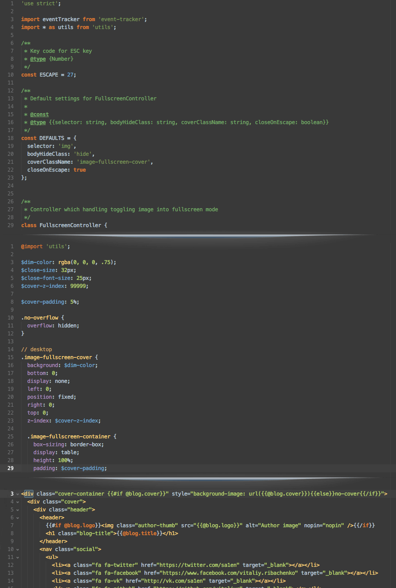

# Atom Darcula Syntax

A syntax theme ported from IntelliJ for Atom. Once you tried, you can't live without it.

Ported manually as accurately as possible.

Suits best with [Nucleus Dark UI](https://atom.io/themes/nucleus-dark-ui).

## Notice
Because Atom is still just a text editor, it doesn't parse your code (e.g. JS) in a way that IntelliJ does. That's why there are some differences between highlight same script in Atom and IntelliJ.

## Know issues
* **JS: instanceof, delete doesn't colored orange.** That's because atom-javascript package makes no difference between 'delete' and logical operators (!==, && etc). There is a [discussion](https://github.com/atom/language-javascript/issues/188) already.
